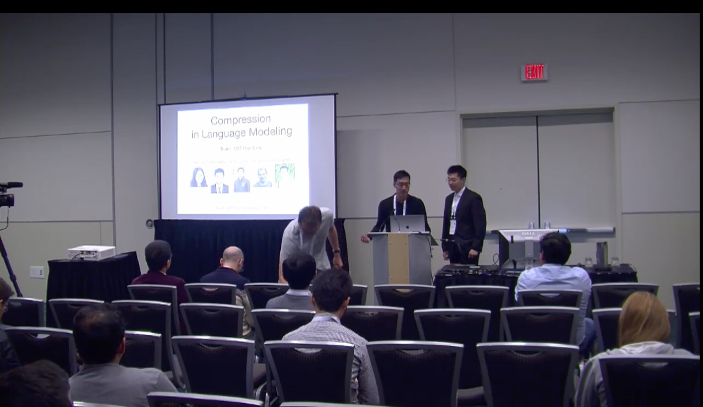

# MicroNet: Team MIT-HAN-Lab

## News
Hanrui and Zhongxia gave a [talk](https://slideslive.com/38922007/competition-track-day-13)(Start from 33:35) on the challenge in NeurIPS 2019, Vancouver.

## Introduction
This codebase is the Champnion submission for NeurIPS 2019 MicroNet Challenge on the [WikiText-103 Language Modeling task](https://micronet-challenge.github.io/index.html).

Team Member: Demi Guo\*, Hanrui Wang\*, Zhongxia Yan\*, Phillip Isola, Song Han. (\*Equal Contribution)

The codebase consists of:
* IPython notebooks which verify test perplexity and calculate the final score
* A write-up which describes our methodology and calculations in details
* Three model paths of our submissions (in WikiText-103)

*We run our codebase on Python 3.6.8 and Pytorch 1.1.0*

## Method 
We use an efficient primitive modified based on Transformer-XL. Specifically, we make use of shorter attention length, trainable cache, Hebian updates, and a tied adaptive embedding and softmax layer.
After training our primitive model, we run knowlege distillation to get a better performance. Finally, we run prunning and quantization to futher compress the model.
For more details, see our write-up: [report].(report.pdf)

## Submission 

| ID  | Notebook  | Sparsity (%) | Quantization (Bit)| Test PPL | **Score** |
| --- |:---------:| --------:|-------------:|---------:|----------:|
| 1 | [Notebook1](micronet_challenge-wikitext_103-1.ipynb)| 42.12 | 9 | 34.95 | **0.0482** |
| 2 | [Notebook2](micronet_challenge-wikitext_103-2.ipynb)| 40.12 | 9 | 34.65 | **0.0485** |
| 3 | [Notebook3](micronet_challenge-wikitext_103-3.ipynb)| 33.85 | 8 | 34.95 | **0.0475** |

Our best submission has [score](https://micronet-challenge.github.io/scoring_and_submission.html) **0.0475**.

## Verification
To verify test perplexity and score calculation, please refer to the corresponding IPython Notebooks. 
Before running the notebooks, it's required to download the data [here](https://www.dropbox.com/sh/nsj396bg6c4uy5a/AADlWpvbH7rD-Gku3HCt3_sDa?dl=0) and put the files in a newly created "cache" folder in the main directory.

## FAQ
If you have any further questions about our submission, please don't hesitate reaching out to us through Github Issues :)
Thanks!

## Contact
Hanrui Wang (hanrui@mit.edu)

